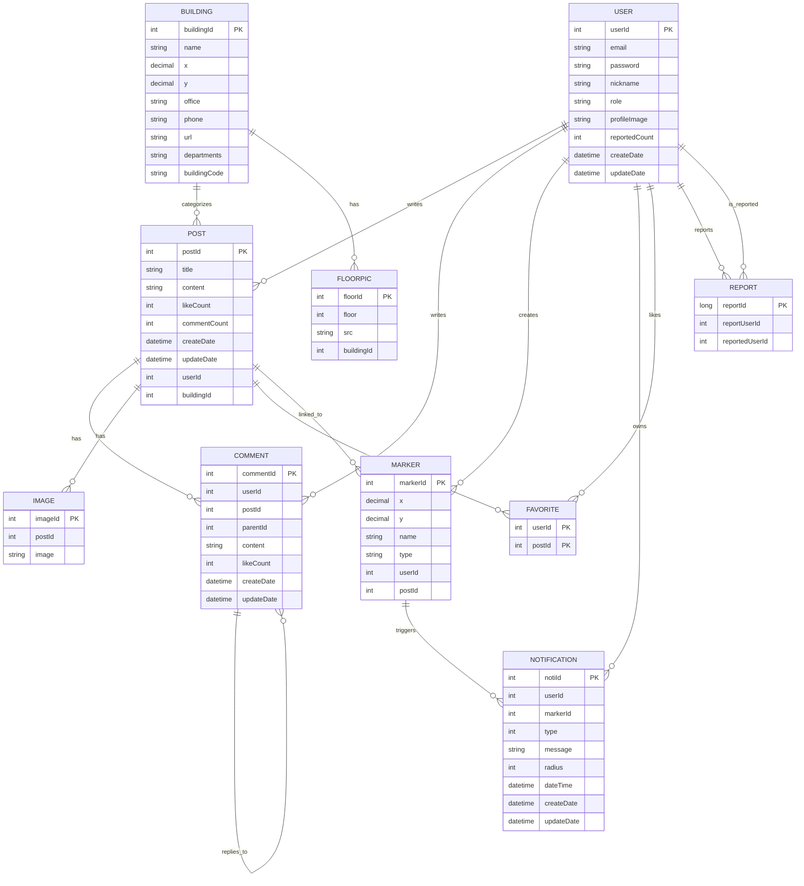
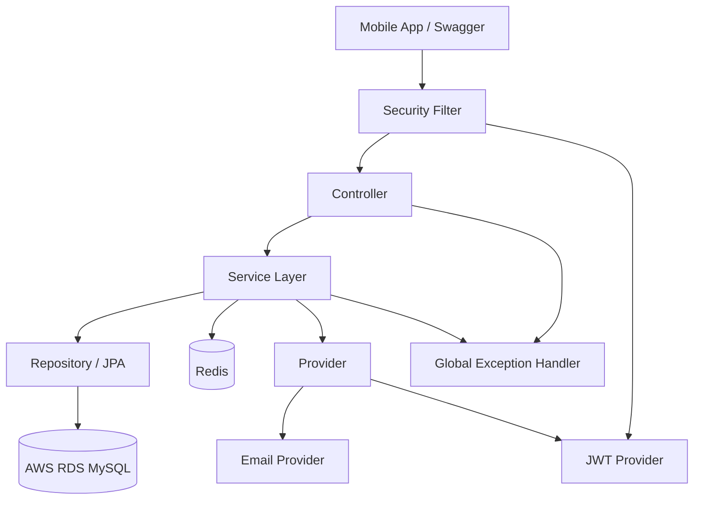

# SERVER

## TEAM ATLANTIS 졸업작품

위치 기반 **맞춤형 알림**을 제공해요! 캠퍼스 내의 다양한 장소와 이벤트에 대한 **정보를 손쉽게 공유**해요

"commINUty"는 팀 아틀란티스의 졸업작품으로, 현대적인 캠퍼스 생활을 위한 혁신적인 솔루션을 제공하는 앱입니다. 위치 기반 기술을 활용하여 사용자에게 맞춤형 알림을 제공하고, 캠퍼스 내의 다양한 장소와 이벤트에 대한 정보를 손쉽게 공유할 수 있게 해줍니다.

<br>

## 🍎 Server Developer

| [채은](https://github.com/CHANGEL1004) | [은진](https://github.com/PanicAthe) |
| :--: | :--: |
|  |  |

<br>

## 📚 Tech Stack

| Category | Used |
| --- | --- |
| Language | Java 17 |
| Framework | Spring Boot 3.2.2 |
| Security | Spring Security + JWT |
| ORM | Spring Data JPA (Hibernate) |
| Database | AWS RDS (MySQL 8.0), Redis |
| Cloud | AWS EC2 (Ubuntu 22.04 LTS) |
| API Docs | Swagger (SpringDoc OpenAPI 3) |
| Test | JUnit 5, Mockito, Spring Security Test |
| Monitoring | Spring Boot Actuator, Prometheus, Grafana |
| Build Tool | Gradle |

<br>

## ✨ 주요 기능

### 위치 기반 알림 (지오펜싱)
설정한 위치에 근접할 시 알림 발송

### 게시글
위치 설정 없이도 게시글 작성 가능, 댓글 및 대댓글 지원

### 추천 기능
추천수 기반으로 인기 게시글 및 마커 노출

### 인증 및 보안
이메일 인증, JWT 기반 로그인, refresh token 재발급 지원

### 사용자 마커 생성
특정 위치를 지정하고 게시글을 작성하면 지도 마커 생성

### 건물 정보 및 평면도
강의실 검색을 통한 해당 층 평면도 확인

<br>

## 🔌 API 구조

| 도메인 | Base URL | 주요 기능 |
| --- | --- | --- |
| 인증 | `api/v1/auth` | 이메일 중복 확인, 이메일 인증, 회원가입, 로그인, 토큰 재발급, 회원탈퇴, 비밀번호 변경 |
| 마커 | `api/v1/marker` | 마커 생성/조회/수정/삭제, 건물 검색, 인기 마커, 내 마커 |
| 게시글 | `api/v1/post` | 게시글 CRUD, 댓글/대댓글, 좋아요, 검색 |
| 사용자 | `api/v1/user` | 프로필 조회/수정, 닉네임 변경, 신고 |
| 알림 | `api/v1/noti` | 알림 생성/조회/수정/삭제 |
| 파일 | `api/v1/file` | 이미지 업로드, 이미지 조회 |

<br>

## 📦 ERD



<br>

## 🗂️ 프로젝트 구조

```text
src/
├── main/
│   ├── java/com/atl/map/
│   │   ├── common/          # 공통 유틸
│   │   ├── config/          # Security, Async, Cache, Rate Limit 설정
│   │   ├── controller/      # REST 컨트롤러 (Auth, Marker, Post, User, Noti, File)
│   │   ├── dto/
│   │   │   ├── object/      # 공통 객체 DTO
│   │   │   ├── request/     # 요청 DTO
│   │   │   └── response/    # 응답 DTO
│   │   ├── entity/          # JPA 엔티티
│   │   │   └── primaryKey/  # 복합 키
│   │   ├── exception/       # ErrorCode, BusinessException
│   │   ├── filter/          # JWT 인증 필터
│   │   ├── handler/         # 전역 예외 처리
│   │   ├── provider/        # JWT, Email 프로바이더
│   │   ├── repository/      # JPA 레포지토리 및 ResultSet
│   │   └── service/         # 서비스 인터페이스, 구현체, 캐시 조회 서비스
│   └── resources/
│       ├── application.yml.example
│       └── db/
│           ├── seed/        # 성능 측정용 시드 SQL
│           └── index/       # 인덱스 후보 SQL
└── test/
    └── java/com/atl/map/    # 인증, 게시글, 보안 응답 테스트
```

## 🏗️ 백엔드 아키텍처



### 계층 설명

- `Controller`: 요청 검증, 인증 사용자 정보 추출, 응답 반환
- `Service`: 비즈니스 로직 처리, 트랜잭션 관리, 캐시/토큰/요청 제한 제어
- `Repository`: JPA 기반 DB 접근과 커스텀 조회/갱신 쿼리 수행
- `Provider`: JWT 생성/검증, 이메일 발송 같은 외부 기능 캡슐화
- `Redis`: 인증번호 TTL 저장, refresh token 저장, rate limit, 조회 캐시에 활용
- `Global Exception Handler`: `BusinessException`을 표준 응답 형식으로 변환

## 📈 모니터링

- `Spring Boot Actuator`로 `health`, `info`, `metrics`, `prometheus` 엔드포인트를 노출합니다.
- `Prometheus`가 애플리케이션 메트릭을 수집할 수 있도록 `docker-compose`에 연동했습니다.
- `Grafana`를 함께 구성해 Prometheus datasource와 기본 대시보드가 자동으로 로드되도록 했습니다.
- JVM, HTTP, 프로세스, 시스템 메트릭, HikariCP, 캐시, 보안 필터 메트릭과 애플리케이션 health 상태를 기본적으로 확인할 수 있습니다.

## ⚙️ 로컬 실행 방법

1. `src/main/resources/application.yml.example`을 복사해 `application.yml` 생성
2. DB, JWT, Gmail, Redis, 파일 경로 등 환경값을 채운다
3. Redis 기능 사용을 위해 로컬 Redis를 실행한다
4. 애플리케이션 실행 후 `http://localhost:8080/swagger-ui.html` 에서 API 확인

### 주요 환경값

- `secret-key`: JWT 서명 키
- `app.security.jwt.access-token-expiration-seconds`: access token 만료시간
- `app.security.jwt.refresh-token-expiration-seconds`: refresh token 만료시간
- `app.security.rate-limit.email-certification.*`: 이메일 인증 요청 제한 설정
- `app.security.cors.allowed-origin-patterns`: 허용할 프론트 origin 패턴
- `file.path`, `file.url`: 업로드 파일 저장 경로와 접근 URL
- `management.endpoints.web.exposure.include`: 모니터링 엔드포인트 노출 범위

## 🐳 Docker 실행 방법

`docker-compose.yml` 기준으로 앱, Redis, Prometheus, Grafana를 컨테이너로 실행하고, DB는 기존 RDS에 연결할 수 있습니다. Docker 실행은 로컬 `application.yml`이 아니라 `application-docker.yml`과 환경변수를 사용합니다.

1. `docker-compose.yml`의 아래 환경값을 실제 값으로 수정
   - `DB_HOST`
   - `DB_USERNAME`
   - `DB_PASSWORD`
   - `SECRET_KEY`
   - `SPRING_MAIL_USERNAME`
   - `SPRING_MAIL_PASSWORD`
   - 필요 시 `CORS_ALLOWED_ORIGINS`
2. 앱 컨테이너는 `docker` 프로필로 실행되며, `application-docker.yml`에서 datasource / Redis / mail / monitoring 설정을 읽습니다.
3. 아래 명령으로 빌드 및 실행

```bash
docker compose up --build
```

4. 실행 후 확인
   - API: `http://localhost:8080`
   - Swagger: Docker의 `docker` 프로필에서는 비활성화
   - Actuator Health: `http://localhost:8080/actuator/health`
   - Prometheus Metrics: `http://localhost:8080/actuator/prometheus`
   - Prometheus UI: `http://localhost:9090`
   - Grafana UI: `http://localhost:3001` (`admin` / `admin`)

참고:
- Docker에서는 Prometheus 수집을 위해 `/actuator/health`, `/actuator/prometheus`만 공개합니다.
- 나머지 Actuator 엔드포인트는 인증 없이 열지 않습니다.

즉, Docker에서는 애플리케이션, Redis, Prometheus, Grafana를 띄우고, MySQL은 기존 RDS를 그대로 사용하는 방식입니다.

중지:

```bash
docker compose down
```
